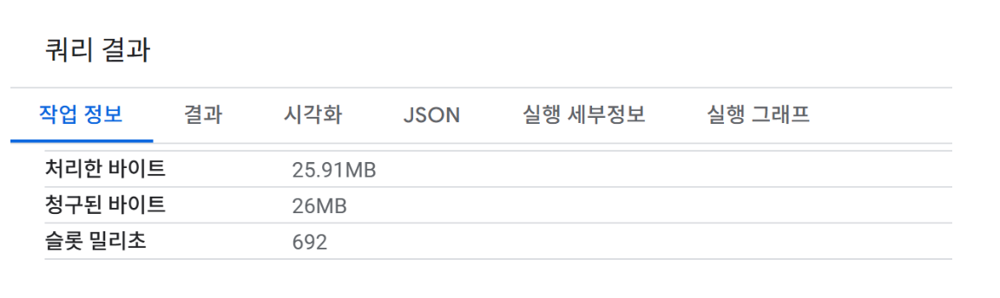
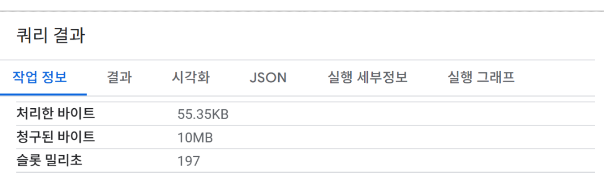
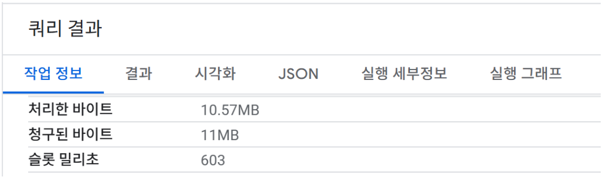
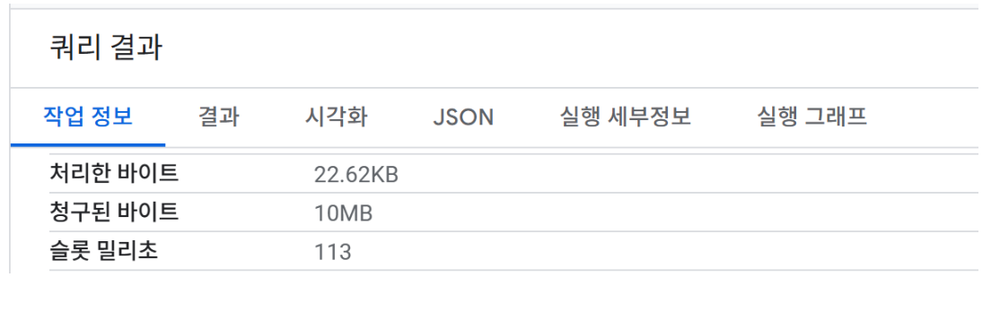
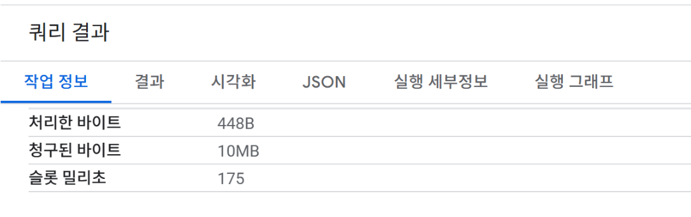

# BigQuery Optimisation (Partitioning & Clustering)

이 프로젝트는 BigQuery 비용/성능 최적화를 위해 **Partitioning(파티셔닝)** 과 **Clustering(클러스터링)** 을 Data Mart build 전에 적용했습니다.  
분석 쿼리 패턴이 signup_date 기준 **14/30/60/180일 윈도우** + **user/session 단위 집계**가 반복되기 때문에 효율을 높이기 위해 설계하였습니다.

---

## What we optimised (Final)

Raw 테이블은 그대로 두고, 아래 3개 대형 테이블을 **날짜 파티션 + 핵심 키 클러스터**로 최적화 를 진행했습니다.

---

### 1) events → events_p
- **Partition:** `DATE(event_ts)`
- **Cluster:** `user_id, session_id, event_type`
- 이유
  - events가 가장 크고 스캔 비용이 커서 **시간 필터 + user/session/event_type 조합**이 핵심
  - product_id는 특정 분석에서만 쓰여 **기본 clustering에서 제외**

**Before (no partitioning/clustering)**  

**After (partitioning/clustering applied)**  

---

### 2) sessions → sessions_p
- **Partition:** `DATE(session_start_ts)`
- **Cluster:** `user_id, session_id`
- 이유: 세션 기반 분석/조인이 `user_id/session_id` 중심

**Before (no partitioning/clustering)**  

**After (partitioning/clustering applied)**  

---

### 3) orders → orders_p
- **Partition:** `DATE(order_ts)`
- **Cluster:** `user_id`
- 이유
  - 주문은 대부분 **유저 단위 집계(LTV/재구매/구매여부)** 중심
  - `order_id`는 unique라 clustering 효율이 낮아 제외

**Before (no partitioning/clustering)**  

**After (partitioning/clustering applied)**  

---

## (rename) strategy

기존 테이블을 보관하면서, 최적화 테이블을 **rename으로 안전하게 교체 하였습니다.**  
(그래서 이후 쿼리는 기존 테이블명 events/sessions/orders 그대로 사용 가능)

---

## Notes

- Clustering 키는 “많이 넣기”보다 **반복되는 핵심 쿼리 패턴에 맞춰 최소화**하는 게 효율적이라 생각하여 최종 키를 단수화 하는데 목표를 두었습니다.
- Partitioning/Clustering은 **저장 구조 최적화**이므로, 분석 결과(전환율/LTV/retention 값)는 영향을 끼치지 않는다.
