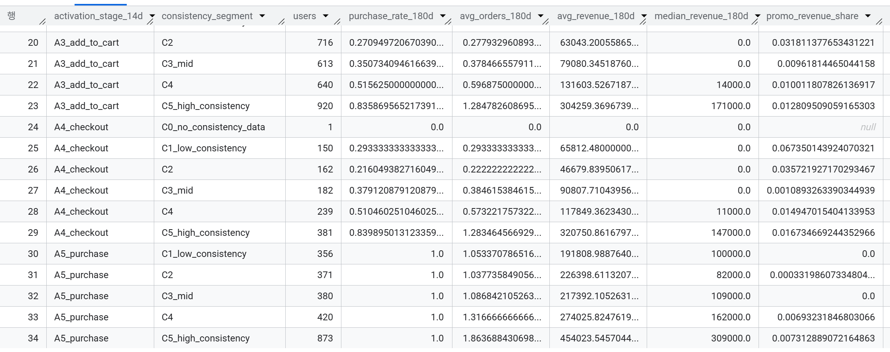
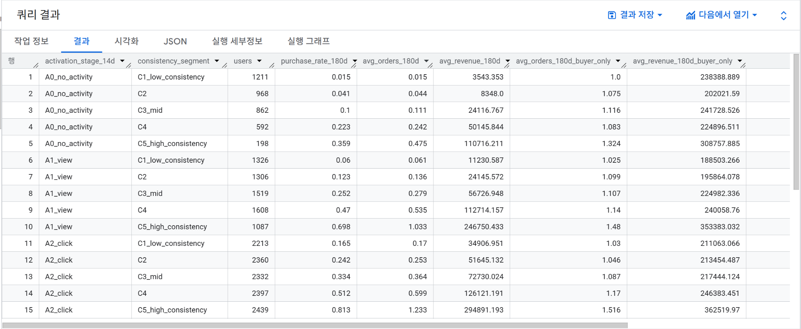
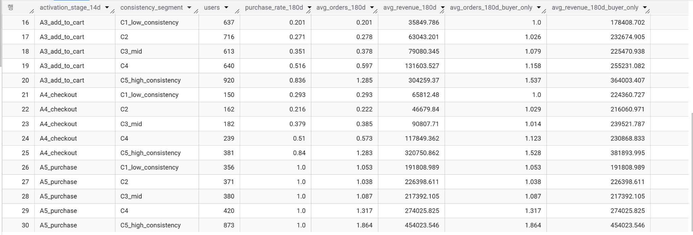
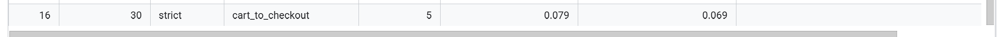

# [Story] Activation × Consistency → Future LTV/Retention (v1.0 → v1.1)

초기 Activation만으로는 180일 성과를 설명하기 어렵고, **Consistency**가 추가로 성과를 갈라낸다. 이를 **Time-split(0–60d → 60–180d)** 로 재검증했다.

---

## 0) Executive Summary

### 0.1 What we saw (v1.0)

- 유저를 Activation stage(A0-A5)로 나눈 뒤, 각 stage 내부에서 Consistency(C1-C5)로 다시 나누면 **C1 → C5로 갈수록 180일 구매율/매출이 뚜렷하게 상승**하는 패턴이 반복적으로 관찰된다.
- 특히 **낮은 Activation(A0-A2)** 구간에서 Consistency에 따른 성과 격차(lift)가 더 크게 나타난다. 즉, 초기 전환이 낮아 보여도 **리듬(Consistency)**이 안정적이면 장기 성과에서 회복/역전 가능성이 있다.
- 단, v1.0은 동일한 0-180일 창에서 “신호(Activation/Consistency)”와 “성과(구매/매출)”가 함께 움직일 수 있어(누수/tautology 가능성), 이후 v1.1에서 **관측창(0-60d) vs 성과창(60-180d) time-split**으로 재검증이 필요하다.

### 0.2 What we saw (v1.1)

- v1.0의 한계(동일 0–180d 창에서 predictor/outcome이 함께 움직일 수 있음)를 줄이기 위해, **관측창(0–60d)** 과 **성과창(60–180d)** 을 분리(Time-split)해 재검증했다.  
- Time-split 후에도 **초기 리듬(Consistency)** 이 이후 성과(60–180d 구매율/매출/리텐션)와 **단조롭게 연결되는 패턴이 유지**됐다.  
- 특히 **Activation 수준이 같아도**(Activation bucket 고정), Consistency가 높은 그룹이 **구매율/매출/리텐션이 더 높아** Consistency의 **추가 설명력**이 확인됐다.  
- 이를 바탕으로 Activation×Consistency 조합으로 만든 **Persona(예: Loyal/Steady/Burst/Observer)** 가 60–180d 성과를 뚜렷하게 구분해, **세그먼트 기반 액션 설계**에 바로 연결할 수 있다.

---

## 1) Definitions (v1.0 기준)

### 1.1 Activation stage (첫 14일)
- A0: no activity  
- A1: view  
- A2: click  
- A3: add_to_cart  
- A4: checkout  
- A5: purchase

> 사용 DM: `DM_user_window` (has_view_14d ~ has_purchase_14d)

### 1.2 Consistency (0~180일, v1.0)
- 세션 기반 지표(예: active_days, intervisit_cv 등)로 Consistency score를 만들고,
- score를 **퀸타일로 C1(하위) - C5(상위)**로 구간화

> 사용 DM: `DM_consistency_180d`

### 1.3 Long-term outcomes (0~180일, v1.0)
- 구매/매출: `DM_ltv_180d`
- 리텐션: `DM_retention_cohort` (day 180 정의 포함)

---

## 2) Finding #1 — Activation만으로는 부족하고, 같은 Activation 안에서도 Consistency 차이가 크게 보인다 (v1.0)

### Key takeaway
- **Result:** 같은 Activation stage 안에서도 Consistency(C1→C5)에 따라 180일 구매율/매출/리텐션 성과가 뚜렷하게 갈린다.
- **So what:** 초기 퍼널 도달(Activation)만으로 유저의 장기 가치를 판단하면 놓치는 그룹이 생기며, ‘재방문 리듬(Consistency)’를 함께 봐야 세그먼트 기반 액션이 가능해진다.
- **Evidence:** Figure 01 / Figure 03 (Activation × Consistency × LTV/Retention)

Activation stage가 높을수록 평균적으로 성과가 좋아지는 건 자연스러운 흐름이지만,  
**같은 Activation stage 내부에서도 Consistency(C1~C5)에 따라 180일 성과가 꽤 다르게 나타났다.**

- “초기 퍼널 도달”은 분명 중요한 신호지만,
- 그 이후 **얼마나 규칙적으로 다시 방문/활동했는지(Consistency)**가 함께 보일 때  
  유저의 180일 성과를 더 입체적으로 설명할 수 있었다.

### Figure 01 — Activation × Consistency × (LTV / Retention)
- Query: `src/sql/analysis/00_story_core/01_final_activation_x_consistency_ltv180d_retention_point.sql`

### Figure 03 — Activation × Consistency × LTV (slim)
- Query: `src/sql/analysis/00_story_core/01_activation_x_consistency_x_ltv_slim.sql`

> **주의(해석 한계, v1.0):**  
> Consistency 지표와 180일 성과가 같은 기간(0~180d) 안에서 같이 계산되기 때문에,  
> “예측”이라기보다 “동기간 상관 패턴”이 강하게 섞여 있을 수 있다.  
> 그래서 다음 단계(v1.1)에서 Time-split으로 분리 검증한다.

---

## 3) Finding #2 — Consistency의 격차는 낮은 Activation 구간에서 더 크게 보이는 편이다 (v1.0)

### Key takeaway
- **Result:** Consistency(C5 vs C1) 성과 격차(lift)는 모든 Activation에서 보이지만, 특히 낮은 Activation(A0–A2) 구간에서 더 크게 나타나는 경향이 있다.
- **So what:** ‘초기 전환이 낮아 보이는 유저’ 안에서도 Consistency가 높은 그룹은 장기 성과에서 회복/역전 가능성이 있어, 저Activation 유저를 한 덩어리로 버리면 손해다.
- **Evidence:** Figure 02 (Headline lift: C5 vs C1 by Activation)

C5(상위 Consistency)와 C1(하위 Consistency)을 비교했을 때,  
Activation stage별로 성과 격차(lift)가 동일하게 나타나진 않았다.

정리하면:

- 높은 Activation(A4~A5)에서도 Consistency 차이는 보이지만,
- **낮은 Activation(A0~A2)에서 C1 ↔ C5 격차가 더 크게 관찰되는 경향**이 있었다.

이 말은 “초기 전환이 낮아 보이는 유저” 안에서도  
**방문 리듬이 안정적인 그룹이 이후 성과에서 더 나은 흐름을 보일 수 있다**는 정도로 해석할 수 있다.  
(단, v1.0에서는 동기간 지표 한계가 있으니, v1.1에서 분리 검증 예정)

### Figure 02 — Headline lift (C5 vs C1) by Activation
- Query: `src/sql/analysis/00_story_core/02_headline_lift_c5_vs_c1_by_activation.sql`

---

## 4) Finding #3 — 퍼널 병목은 “어디서 자주 막히는지”와 “어느 세그먼트가 특히 약한지”를 나눠보면 더 명확하다 (v1.0)

### Key takeaway
- **Result:** 퍼널 병목은 ‘자주 발생하는 구간(빈도)’과 ‘특히 약한 세그먼트(조합)’를 분리해서 보면, 같은 퍼널 분석이라도 우선순위가 더 명확해진다.
- **So what:** 먼저 빈도로 전사 우선 개선 구간을 잡고, 그 다음 세그먼트 관점으로 타깃 실험/개입 대상을 좁히는 방식이 액션으로 연결된다.
- **Evidence:** Figure 04 (Bottleneck frequency; reach-based / strict w14/w30)

퍼널 분석을 할 때, 단순히 “전환율이 낮다”에서 끝내면 액션으로 이어지기 어렵다.  
그래서 v1.0에서는 두 가지 관점으로 나눠 봤다.

- **(A) 빈도 관점:** 병목이 “자주 발생하는 구간”은 어디인가?  
- **(B) 세그먼트 관점:** “특히 약한 세그먼트”는 어떤 조합인가?

### Figure 04 — Bottleneck frequency (reach-based, strict w14/w30)
- Query: `src/sql/analysis/00_story_core/02_bottleneck_frequency_reach_strict_w14_w30.sql`

---

## 5) Finding #4 — 최약 세그먼트 Top10을 보면 “개선 우선순위”가 더 구체적으로 잡힌다 (v1.0)

### Key takeaway
- **Result:** strict 기준 Worst Top10을 보면, 14d에서는 `view_to_click × A1_view`가 최악(전환 0%, 모수 약 2.6k~3.2k)이고, 30d에서는 `click_to_cart × A2_click`에서 특히 low consistency(C1/C2)의 전환이 최저(약 4–5%)인 반면 C5_high는 ~16%까지 회복한다.
- **So what:** 우선순위는 (1) 14d `view→click` 전사 개선, (2) 30d `click→cart` 저일관성 clicker 타깃 실험/개입으로 분리하는 게 합리적이다.
- **Evidence:** Figure 05 (Worst segments Top10; strict w14/w30)

**왜 최약 세그먼트(Top10)를 보나?**  
전체 평균만 보면 병목이 희석될 수 있어, w14/w30 **strict** 기준으로 성과가 가장 낮은 세그먼트 조합 Top10을 뽑아 *어느 조합에서 퍼널이 가장 심하게 깨지는지*를 확인했다.  
이렇게 하면 개선/실험을 **세그먼트 단위 액션**으로 바로 설계할 수 있다.

- 14d: 최악 Top5가 전부 `view_to_click × A1_view`이며, Consistency(C1-C5)와 무관하게 conv_rate = 0% (모수 약 2.6k~3.2k).
  → 초기 실패의 핵심은 “view 이후 click으로 못 넘어감”.

- 30d: 최악 세그먼트는 대부분 `click_to_cart × A2_click`이고, 특히 low consistency(C1/C2)에서 전환이 최저(약 4-5%, 모수 5k~6k). 반면 C5_high는 ~16%까지 회복.
  → 30일 관점 병목은 “click → cart”이며, 저일관성 clicker가 최우선 타깃.

- Action 제안: (1) 14d `view→click` 전사 UX 개선 + (2) 30d `click→cart` 저일관성 세그먼트 대상 타깃 실험/개입으로 우선순위 분리.

### Figure 05 — Worst segments Top10 (strict w14/w30)
- Query: `src/sql/analysis/00_story_core/03_bottleneck_worst_segments_top10_strict_w14_w30.sql`

---

## 6) v1.1 — Time-split으로 “관측(0–60d) → 성과(60–180d)”를 분리해 재검증

### Key takeaway
- **Result:** v1.0의 동기간(0–180d) 상관/tautology 가능성을 줄이기 위해, 관측(0–60d)과 성과(60–180d)를 분리한 time-split으로 동일 질문을 재검증한다.
- **So what:** 이후 결과는 ‘동기간 상관’이 아닌 ‘초기 행동/리듬이 이후 성과와 연결되는지’를 보여주므로, v1.0보다 해석 방어력이 강해진다.
- **Evidence:** Result 01–03 (v1.1 figures_v1.1)

v1.0 결과는 “Activation만으로는 부족하고 Consistency가 성과와 함께 움직인다”는 패턴을 보여줬다.  
다만 v1.0은 일부 지표가 **동기간(같은 0–180d 창)**에서 계산돼 상관(tautology) 우려가 남는다.

그래서 v1.1에서는 **관측(0–60d)**에서 early behavior/consistency를 정의하고,  
**성과(60–180d)**에서 purchase/revenue/retention을 측정해 같은 패턴이 유지되는지 확인한다.

---

## 6.1) Result 01 — Persona snapshot (Activation × Consistency)

### Key takeaway
- **Result:** Persona 간 60–180d 성과가 뚜렷하게 갈리며, D_Loyal이 전반적으로 가장 높고 B_Observer는 낮다.
- **So what:** Activation만이 아니라 ‘재방문 리듬/성향’까지 포함한 persona 단위로 KPI/액션을 설계하면, 세그먼트 기반 운영(예: 타깃 캠페인/개입)이 가능해진다.
- **Evidence:** persona_result.png (Persona snapshot: Activation × Consistency)

- Query: `src/sql/analysis/story_core_v1.1/Persona_Analysis.sql`

Persona 간 성과가 뚜렷하게 갈린다.  
특히 **D_Loyal**은 60–180d 매출/구매율/리텐션이 모두 가장 높고, **B_Observer**는 전반적으로 낮다.

- 핵심: “초기 구매(Activation)만이 아니라, 이후 리듬/재방문 성향이 장기 성과를 좌우”하는 그림이 나온다.
- 활용: Tableau에서 persona별 KPI 카드/트렌드로 보여주기 좋다.

> **Note (limitation):** 이 결과는 synthetic 데이터 설정(시뮬레이션 가정)에 영향을 받으므로, **절대 수치보다 ‘방향성/프레임(해석 구조)’** 에 초점을 둔다.

---

## 6.2) Result 02 — Consistency (0–60d) → Outcomes (60–180d)

### Key takeaway
- **Result:** 0–60d Consistency가 높아질수록(C1→C5) 60–180d 구매율/매출/리텐션이 단조 증가한다(시간 분리 후에도 패턴 유지).
- **So what:** Consistency는 ‘초기 60일의 리듬’ 관점에서 이후 120일 성과를 설명하는 유의미한 신호가 될 수 있다.
- **Evidence:** Consistency_outcome.png (Consistency 0–60d → Outcomes 60–180d)

- Query: `src/sql/analysis/story_core_v1.1/04_timesplit__consistency_0_60_segment__outcomes_60_180.sql`

0–60d Consistency가 높아질수록(C1→C5) 60–180d 성과가 **단조 증가**한다.  
매출/구매율/리텐션이 모두 같은 방향으로 움직여, “Consistency가 미래 성과를 가른다”를 time-split으로 재확인한다.

- C1→C5로 갈수록 avg_revenue_60_180, purchase_rate_60_180, retention_last_week_180d_rate가 모두 상승
- 메시지: “초기 60일의 리듬(Consistency)은 이후 120일 성과를 예측/설명하는 신호다.”

> **Note (limitation):** time-split으로 동기간 상관은 줄였지만, 여전히 **생성 로직/가정에 의해 효과 크기(lift)가 커 보일 수 있어** 과도한 일반화는 피한다.

---

## 6.3) Result 03 — Activation × Consistency → Outcomes (time-split)

### Key takeaway
- **Result:** Activation 수준이 같아도 Consistency(C1→C5)에 따라 60–180d 성과가 크게 달라지며, Activation만으로는 설명이 끝나지 않는다.
- **So what:** 초기 전환이 낮아도 Consistency가 좋은 그룹은 장기 성과에서 회복 가능성이 있어, ‘Activation 중심’ 관점만으로 타깃/평가하면 기회를 놓칠 수 있다.
- **Evidence:** Activation_x_consistency_outcome.png (Activation 0–14d × Consistency 0–60d → Outcomes 60–180d)

- Query: `src/sql/analysis/story_core_v1.1/05_activation14d_x_consistency0_60d_summary.sql`
  

Activation 구간이 같아도, Consistency(C1→C5)에 따라 60–180d 성과가 크게 달라진다.  
즉, Activation만으로는 설명이 끝나지 않고 Consistency가 추가 설명력을 갖는다.

- 같은 activation_bucket_14d 안에서 C1→C5로 갈수록 purchase_rate_60_180 / avg_revenue_60_180 / retention이 상승
- 특히 Act_Low/Act_Mid에서도 C5가 의미 있게 높은 성과를 보이며 “초기 전환이 낮아도 리듬이 좋으면 회복 가능” 시그널이 나온다.

> **Note (limitation):** 본 프로젝트는 인과추론이 목적이 아니라 “분석 프레임/SQL+DM 설계 역량”을 보여주기 위한 synthetic 시뮬레이션이므로, **관계(패턴) 제시**를 핵심으로 한다.

---

## Appendix) Used Data Marts (v1.0)
- `ecommerce_dm.DM_user_window`
- `ecommerce_dm.DM_consistency_180d`
- `ecommerce_dm.DM_ltv_180d`
- `ecommerce_dm.DM_retention_cohort`
- `ecommerce_dm.DM_funnel_kpi_window`
- `ecommerce_dm.DM_funnel_session`

## Appendix) Used Data Marts (v1.1)
- `ecommerce_dm.DM_timesplit_60_180_final`
---
