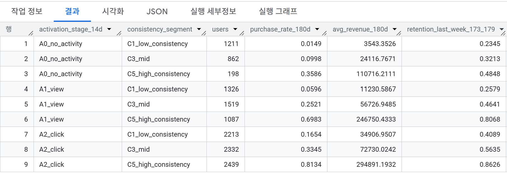
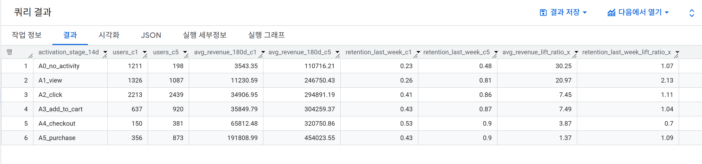
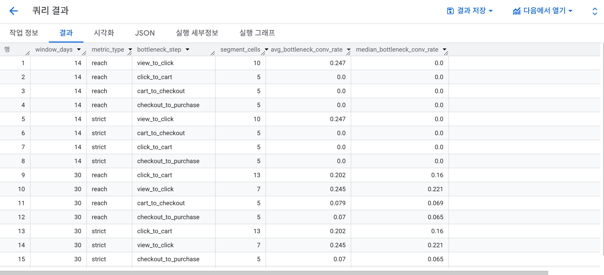
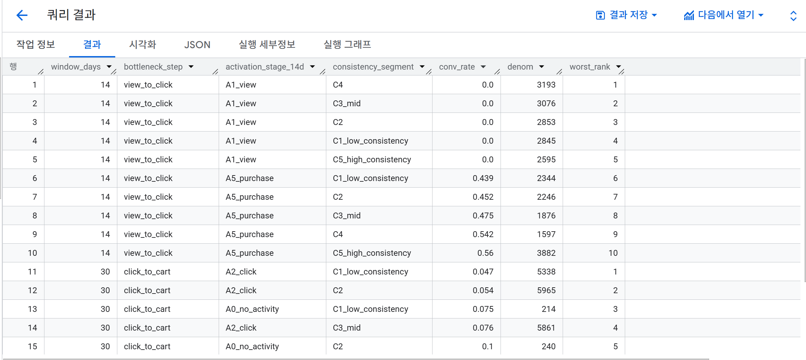
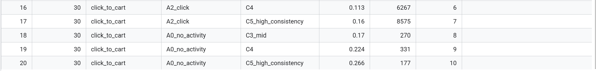
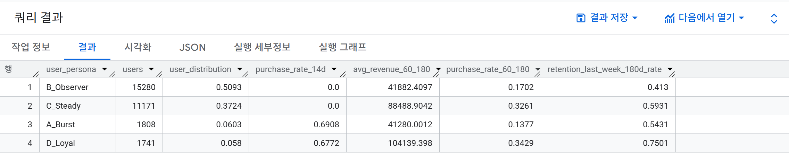
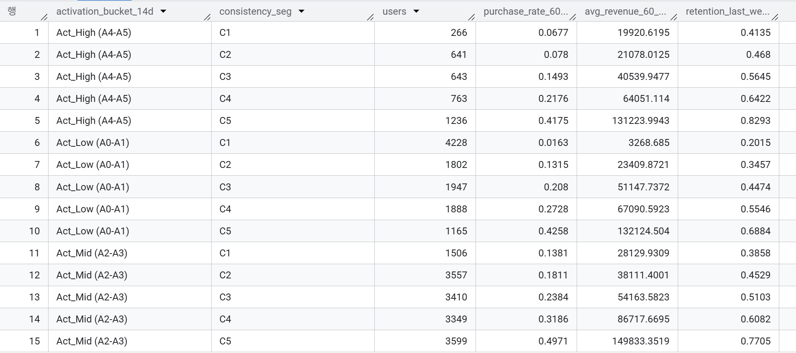

# [Story] Activation × Consistency → Future LTV/Retention (v1.0 → v1.1)

초기 Activation만으로는 180일 성과를 설명하기 어렵고, **Consistency**가 추가로 성과를 갈라낸다. 이를 **Time-split(0–60d → 60–180d)** 로 재검증했다.

---

## 0) Executive Summary

### 0.1 What we saw (v1.0)

- 유저를 Activation stage(A0-A5)로 나눈 뒤, 각 stage 내부에서 Consistency(C1-C5)로 다시 나누면 **C1 → C5로 갈수록 180일 구매율/매출이 뚜렷하게 상승**하는 패턴이 반복적으로 관찰된다.
- 특히 **낮은 Activation(A0-A2)** 구간에서 Consistency에 따른 성과 격차(lift)가 더 크게 나타난다. 즉, 초기 전환이 낮아 보여도 **리듬(Consistency)**이 안정적이면 장기 성과에서 회복/역전 가능성이 있다.
- 단, v1.0은 동일한 0-180일 창에서 “신호(Activation/Consistency)”와 “성과(구매/매출)”가 함께 움직일 수 있어(누수/tautology 가능성), 이후 v1.1에서 **관측창(0-60d) vs 성과창(60-180d) time-split**으로 재검증이 필요하다.

### 0.2 What we saw (v1.1)

- v1.0의 한계(동일 0–180d 창에서 predictor/outcome이 함께 움직일 수 있음)를 줄이기 위해, **관측창(0–60d)** 과 **성과창(60–180d)** 을 분리(Time-split)해 재검증했다.  
- Time-split 후에도 **초기 리듬(Consistency)** 이 이후 성과(60–180d 구매율/매출/리텐션)와 **단조롭게 연결되는 패턴이 유지**됐다.  
- 특히 **Activation 수준이 같아도**(Activation bucket 고정), Consistency가 높은 그룹이 **구매율/매출/리텐션이 더 높아** Consistency의 **추가 설명력**이 확인됐다.  
- 이를 바탕으로 Activation×Consistency 조합으로 만든 **Persona(예: Loyal/Steady/Burst/Observer)** 가 60–180d 성과를 뚜렷하게 구분해, **세그먼트 기반 액션 설계**에 바로 연결할 수 있다.

---

## 1) Definitions (v1.0 기준)

### 1.1 Activation stage (첫 14일)
- A0: no activity  
- A1: view  
- A2: click  
- A3: add_to_cart  
- A4: checkout  
- A5: purchase

> 사용 DM: `DM_user_window` (has_view_14d ~ has_purchase_14d)

### 1.2 Consistency (0~180일, v1.0)
- 세션 기반 지표(예: active_days, intervisit_cv 등)로 Consistency score를 만들고,
- score를 **퀸타일로 C1(하위) - C5(상위)**로 구간화

> 사용 DM: `DM_consistency_180d`

### 1.3 Long-term outcomes (0~180일, v1.0)
- 구매/매출: `DM_ltv_180d`
- 리텐션: `DM_retention_cohort` (day 180 정의 포함)

---

## 2) Finding #1 — Activation만으로는 부족하고, 같은 Activation 안에서도 Consistency 차이가 크게 보인다 (v1.0)

### Key takeaway
- **Result:** 같은 Activation stage 안에서도 Consistency(C1→C5)에 따라 180일 구매율/매출/리텐션 성과가 뚜렷하게 갈린다.
- **So what:** 초기 퍼널 도달(Activation)만으로 유저의 장기 가치를 판단하면 놓치는 그룹이 생기며, ‘재방문 리듬(Consistency)’를 함께 봐야 세그먼트 기반 액션이 가능해진다.
- **Evidence:** Evidence: Fig 01 (Activation × Consistency → 180d purchase / revenue / retention)

아래 Figure **Activation bucket 내부에서도** Consistency에 따라 180d 성과가 갈리는 패턴을 보여준다.

### Figure 01 — Activation × Consistency × (LTV / Retention)
- Query: `src/sql/analysis/00_story_core/01_final_activation_x_consistency_ltv180d_retention_point.sql`

> **주의(해석 한계, v1.0):**  
> Consistency 지표와 180일 성과가 같은 기간(0~180d) 안에서 같이 계산되기 때문에,  
> “예측”이라기보다 “동기간 상관 패턴”이 강하게 섞여 있을 수 있다.  
> 그래서 다음 단계(v1.1)에서 Time-split으로 분리 검증한다.

---
## 3) Finding #2 — Consistency의 격차는 낮은 Activation 구간에서 더 크게 보이는 편이다 (v1.0)

### Key takeaway
- **Result:** C5 vs C1 격차는 전 Activation에서 관찰되며, 특히 Low activation(A0–A2)에서 **180d avg_revenue lift(C5/C1)**가 크게 나타난다 (A0 30.25x, A1 20.97x, A2 7.45x).
- **So what:** Low activation 구간에서도 Consistency가 높은 하위군은 장기 성과 잠재력이 있어, Consistency를 추가 신호로 사용해 타깃팅/개입 대상을 정교화할 수 있다.
- **Evidence:** Fig 02 (Activation bucket별 headline lift: C5 vs C1)

Figure 02는 Activation bucket별로 **C5–C1 격차(headline lift)**를 요약한 그림이며, Low activation(A0–A2)에서 lift가 상대적으로 더 크게 나타나는지 확인한다.

### Figure 02 — Headline lift (C5 vs C1) by Activation
- Query: `src/sql/analysis/00_story_core/02_headline_lift_c5_vs_c1_by_activation.sql`

> **Note:** v1.0은 동기간(0–180d) 지표 한계가 있어, 이 패턴은 v1.1 time-split로 재확인한다.
> lift는 ratio(C5/C1) 이므로 C1의 베이스가 낮은 구간(A0–A1)에서 배수가 더 크게 보일 수 있어,
> 표본(users_c1/users_c5) 과 함께 해석한다.

---

## 4) Finding #3 — 퍼널 병목은 “전사 공통 병목”과 “세그먼트 취약 병목”으로 나누면 우선순위가 선명해진다 (v1.0)

### Key takeaway
- **Result:** Result: strict 기준, w14의 최빈 병목은 view→click(n_cell=10), w30의 최빈 병목은 click→cart(n_cell=13). 또한 w14는 median conv_rate=0으로 ‘클릭으로 못 넘어가는’ 세그먼트가 넓게 존재하고, w30은 click→cart의 전환이 상대적으로 낮게 형성되어 30일 관점에서 카트 전환이 반복 병목으로 나타난다.
- **So what:** 병목을 (1) 전사 공통 병목(빈도) 과 (2) 특정 세그먼트 병목(취약 조합) 으로 나누면, “전사 UX 개선”과 “세그먼트 타깃 실험”의 우선순위/역할 분담이 명확해진다.
- **Evidence:** Figure 04 (Bottleneck frequency; strict only, w14/w30)

퍼널을 “전환율이 낮다”로만 보면 액션이 흐려진다. 
그래서 v1.0에서는 두 가지 관점으로 분리해 분석을 진행했.

- **(A) 자주 발생하는 병목(빈도) :** 병목이 “자주 발생하는 구간”은 어디인가?  
- **(B) 세그먼트 관점:** 다음 Finding #4에서 Worst Top10으로 구체화한다.

### Figure 04 — Bottleneck frequency (strict w14/w30)
- Query: `src/sql/analysis/00_story_core/02_bottleneck_frequency_reach_strict_w14_w30.sql`

---

## 5) Finding #4 — 취약 세그먼트 Top10을 보면 “개선 우선순위”가 더 구체적으로 잡힌다 (v1.0)

### Key takeaway
- **Result:** strict 기준 Worst Top10에서 14d는 view→click × A1_view가 상위권을 반복(전환 0% 포함, denom 약 2.6k~3.2k)하며, 30d는 click→cart × A2_click 조합이 다수이고 특히 **low consistency(C1/C2)**에서 전환이 최저(≈4–5%)인 반면 C5는 ~16%까지 회복한다.
- **So what:** 우선순위는 (1) 14d: view→click 전사 개선(예: 첫 클릭 유도/노출·카피·추천 개선)과 (2) 30d: click→cart ‘저일관성 clickers’ 타깃 실험/개입으로 분리하는 게 합리적이다.
- **Evidence:** Fig 05 (Worst segments Top10; strict w14/w30)

**왜 취약약 세그먼트(Top10)를 보나?**  
전체 평균만 보면 병목이 희석된다. strict 기준 Worst Top10은 **전사 공통 병목(어디가 막히는가)**과 **취약 세그먼트 병목(누가 특히 막히는가)**을 분리해 개선 우선순위를 더 구체화한다.

- 14d: 상위는 주로 view→click × A1_view에 집중 → 초기 실패의 핵심은 “view 이후 클릭으로 못 넘어감”

- 30d: 상위는 주로 click→cart × A2_click, 특히 C1/C2에서 취약 → 30일 관점 병목은 “click→cart”, 타깃은 “저일관성 clickers”

### Figure 05 — Worst segments Top10 (strict w14/w30)
- Query: `src/sql/analysis/00_story_core/03_bottleneck_worst_segments_top10_strict_w14_w30.sql`

---

## 6) v1.1 — Time-split으로 “관측(0–60d) → 성과(60–180d)”를 분리해 재검증

### Key takeaway
- **Result:** v1.0에서 보였던 “Activation만으로는 부족하고, Consistency가 장기 성과를 추가로 가른다”는 패턴이 **time-split(0–60d 관측 → 60–180d 성과)** 에서도 **동일하게 재현**된다. 즉, 결과는 ‘동기간 상관’만으로 설명되지 않는다.
- **So what:** 이제 Consistency는 **초기 60일 행동/리듬 기반의 선행 신호**로 해석할 수 있고, 같은 Activation 안에서도 **장기 가치(매출/구매율/리텐션) 관점의 세그먼트 액션**(타깃·개입)을 설계할 근거가 강화된다.
- **Evidence:** Result 01–03 (v1.1 figures_v1.1)

v1.0 결과는 “Activation만으로는 부족하고 Consistency가 성과와 함께 움직인다”는 패턴을 보여줬다.  
다만 v1.0은 일부 지표가 **동기간(0–180d)** 안에서 함께 계산되어, 상관이 **tautology(동기간 산출) 위험**을 완전히 배제하기 어렵다.

그래서 v1.1에서는 **관측 구간(0–60d)**에서 early behavior/consistency를 정의하고, **성과 구간(60–180d)** 에서 purchase/revenue/retention을 측정해 **시간을 분리한 상태에서도 같은 패턴이 유지되는지**를 재검증한다.

---

## 6.1) Result 01 — Persona snapshot (Activation × Consistency)

> Persona는 **Activation(초기 14d)** × **Consistency(0–60d 리듬)** 조합으로 정의했다.

### Key takeaway
- **Result:** time-split(60–180d) 기준에서도 persona별 **매출/구매율/리텐션**이 뚜렷하게 갈린다. 특히 **초기 14d에 구매(Activation)가 없더라도**, 0–60d **Consistency(방문 리듬)** 가 높은 persona는 60–180d 성과가 더 높게 나타난다.
- **So what:** “초기 구매 여부(Activation)”만으로 장기 성과를 판단하기 어렵고, **Consistency가 추가 설명력**을 가진다. 따라서 KPI/액션은 Activation뿐 아니라 **재방문 리듬/성향까지 포함한 persona 단위**로 설계하는 것이 합리적이다.
- **Evidence:** persona_result.png (Persona snapshot: Activation × Consistency)

- Query: `src/sql/analysis/story_core_v1.1/Persona_Analysis.sql`

Persona별 60–180d 성과가 뚜렷하게 갈린다(예: **D_Loyal ↑, B_Observer ↓**).  
이 결과는 “초기 구매(Activation)만이 아니라, 이후 리듬/재방문 성향(Consistency)이 장기 성과를 좌우하는 축으로 작동한다”는 그림을 강화한다.

> **Note (limitation):** 일부 persona의 절대 순위(예: B_Observer > A_Burst)는 synthetic 생성 가정/노이즈의 영향을 받을 수 있어, 본 섹션은 **절대 순위보다 ‘Activation vs Consistency 역할 분리(프레임)’** 에 초점을 둔다.

---

## 6.2) Result 02 — Consistency (0–60d) → Outcomes (60–180d)

### Key takeaway
- **Result:** 0–60d Consistency가 높아질수록(C1→C5) 60–180d **구매율/매출/리텐션이 단조 증가**한다(시간 분리 후에도 패턴 유지).  
  - 예: purchase_rate_60_180 **0.049 → 0.467**, retention_last_week_180d_rate **0.257 → 0.767** (C1→C5).
- **So what:** 초기 60일의 방문 리듬(Consistency)은 이후 120일 성과를 설명하는 **핵심 신호**다. 즉, Activation만으로는 부족하고 **Consistency가 추가 설명력**을 가진다(→ 다음 Result에서 Activation 통제/교차에서도 동일 패턴을 확인).
- **Evidence:** Consistency_outcome.png (Consistency 0–60d → Outcomes 60–180d)

- Query: `src/sql/analysis/story_core_v1.1/04_timesplit__consistency_0_60_segment__outcomes_60_180.sql`

0–60d Consistency가 높을수록(C1→C5) 60–180d 성과가 같은 방향으로 개선된다.  
time-split로 관측(0–60d)과 성과(60–180d)를 분리해도 **“Consistency가 미래 성과와 함께 움직인다”**는 결론이 유지된다.

> **Note (limitation):** synthetic 생성 가정(전환/재방문 로직)에 따라 효과 크기(lift)는 과장될 수 있어, 본 결과는 **인과 주장보다 방향성/프레임 검증** 에 초점을 둔다.

### Python validation (EDA / distribution / simple stats)

아래 그래프는 `DM_timesplit_60_180_final`을 Python에서 다시 집계/시각화해,
SQL에서 확인한 “C1→C5 단조 패턴”이 **표(평균)뿐 아니라 분포/추세 관점에서도 동일하게 보이는지**를 보강한다.

### Python Validation — Retention trend (day 174–180)
> **Purpose:** Consistency(C1–C5)와 180d retention의 단조 관계를 Python에서 재확인한다.  
> **Result:** SQL에서 확인한 **C1→C5 상승 패턴이 동일하게 재현**된다.

/fig_line_retention_174_180_by_consistency_segment_v1_1.png>)

**Python Validation — Distribution (buyers-only, log1p revenue)**  
> **Purpose:** 평균이 outlier에 의해 왜곡될 수 있어, 구매자만 대상으로 `log1p(revenue_60_180)` 분포를 세그먼트별로 비교한다.  
> **Result:** 중앙값/분포에서도 **C1→C5 우상향 경향이 유지**되어, 평균 기반 결론을 보강한다.

/fig_violin_log1p_revenue_60_180_buyers_only_by_consistency_segment_v1_1.png>)

**Python Validation — Bootstrap CI (C5 − C1, purchase_rate_60_180)**  
> **Purpose:** C5와 C1의 구매율 차이를 부트스트랩으로 추정해 불확실성(95% CI)을 함께 제시한다.  
> **Result:** 관측 차이(pp)가 **95% CI 범위에서도 일관**하게 나타나, 효과 크기 방향성 증명한.

/fig_bootstrap_ci_c5_minus_c1_purchase_rate_60_180_v1_1.png>)

---

## 6.3) Result 03 — Activation × Consistency → Outcomes (time-split)

### Key takeaway
- **Result:** time-split(0–60d 관측 → 60–180d 성과)에서도 **Activation 수준이 같아도 Consistency(C1→C5)에 따라 성과가 크게 갈린다.**
  - 예: **Act_Low(A0–A1)**에서도 purchase_rate_60_180이 **0.016(C1) → 0.426(C5)**, retention이 **0.202 → 0.688**로 상승  
  - 예: **Act_High(A4–A5)**에서도 purchase_rate_60_180 **0.068(C1) → 0.418(C5)**, retention **0.414 → 0.829**
- **So what:** **Activation만으로 유저를 평가/타깃팅하면** “초기 전환은 낮지만 리듬이 좋은(high-consistency) 유저(특히 Act_Low/Act_Mid의 C5)”를 **과소평가**해 기회를 놓칠 수 있다.  
  → 운영/개입의 단위는 **Activation 단독이 아니라 Activation×Consistency(persona)**가 더 합리적이다.
- **Evidence:** Activation_x_consistency_outcome.png (Activation 0–14d × Consistency 0–60d → Outcomes 60–180d)

- Query: `src/sql/analysis/story_core_v1.1/05_activation14d_x_consistency0_60d_summary.sql`
  

Activation 구간이 같아도, Consistency(C1→C5)에 따라 60–180d 성과가 일관되게 벌어진다.  
즉, time-split을 적용해도 **Consistency는 Activation을 넘어서는 추가 설명력**을 가진다.

- 같은 activation_bucket_14d 안에서도 C1→C5로 갈수록 **purchase_rate_60_180 / avg_revenue_60_180 / retention**이 상승
- 특히 **Act_Low/Act_Mid에서도 C5가 의미 있게 높아**, “초기 전환이 낮아도 리듬이 좋으면 장기 성과에서 회복 가능” 신호가 유지된다.

> **Note (limitation):** synthetic 데이터 특성상 효과 크기(lift)는 가정에 좌우될 수 있어, 본 결과는 인과추정보다 **관계/프레임(해석 구조) 검증**에 초점을 둔다.

**Python Validation — Heatmap (Purchase rate, 60–180d)**  
> **Purpose:** Activation stage(0–14d) × Consistency(C1–C5) 교차에서 60–180d 구매율이 두 축에 따라 어떻게 달라지는지 한 번에 확인한다.  
> **Result:** (1) 동일 Activation stage 내에서도 **C1→C5로 갈수록 구매율이 상승**하고, (2) 동일 Consistency 구간 내에서도 **Activation stage가 높을수록 구매율이 상승**하는 패턴이 재현된다.

/fig_heatmap_purchase_rate_60_180_by_activation_x_consistency_v1_1.png>)

---

## 7) A/B Test: 관찰 결과를 “개입 효과” 관점에서 검증

### 7.1 왜 A/B Test를 했나 (After v1.1)
v1.0/v1.1(Time-split) 분석에서는 **Consistency(방문 리듬/규칙성)** 가 60–180일 구간 성과(매출/리텐션)와 강하게 연관되는 패턴을 확인했다.  
다만 이 결과는 어디까지나 **관찰(Observational) 기반**이라, time-split으로 누수 위험을 줄였더라도 **교란/선택 효과** 가능성을 완전히 제거할 수는 없다.

따라서 “관찰된 패턴이 실제 개입(intervention)으로도 성과를 움직일 수 있는가?”를 확인하기 위해, **신규 유입 유저 코호트(베이스라인과 분리된 별도 사용자 집합)** 를 대상으로 **2×2 factorial A/B Test**를 수행했다.  
목표는 무작위 배정 하에서 **Consistency/Activation 개입이 각각 장기 KPI(60–180 ΔE[rev])와 초기 KPI(0–13 전환)에 어떤 영향을 주는지** 확인하는 것이다.

---

### 7.2 실험 설계 요약 (2×2 factorial)
- **대상**: 신규 유입 코호트(베이스라인과 분리), 4개 셀에 균등 배정
- **Factor**
  - **Activation uplift (A)**: **초기 전환(0–13일)** 개선을 목표로 하는 소폭 개입
  - **Consistency uplift (C)**: 초기 생애주기에서 **방문 리듬/규칙성(weekly cadence)** 을 강화하는 개입
- **셀 구성**: CC(대조), CT(C만), TC(A만), TT(A+C)
- **장기 KPI(Primary)**: **60–180 ΔE[rev]**
  - 60–180일 구간의 기대매출 변화(0 포함 평균; *synthetic units*)
- **초기 KPI(Secondary)**: **0–13일 early conversion / 주문율**
- **추정/해석 기준**: bootstrap 95% CI
  - 95% CI가 **0을 포함하지 않으면**, 방향성 있는 효과로 해석한다.
  - 95% CI가 **0을 포함하면**, 현 결과만으로 효과를 확정하기 어렵다.

> 데이터/분석 파이프라인: AB 전용 신규 유입 코호트(베이스라인과 분리)로 데이터셋을 생성한 뒤, DM_ab_user_kpi → CSV export → Python(bootstrap) 흐름으로 효과를 추정했다.

---

### 7.3 결과 (그래프 2장으로 핵심만)

#### Figure 7-1. Bootstrap 분포: 60–180 ΔE[rev]에서 Consistency main effect
Consistency main effect의 bootstrap 95% CI가 0을 상회하여, 60–180 ΔE[rev]에서 **Consistency main effect가 양(+)의 방향임을 시사**한다.  
(모든 금액 단위는 *synthetic units*로 표기)

/fig01_ab_bootstrap_deltaErev_hist.png>)

> 캡션: “Bootstrap 95% CI가 0을 상회 → 60–180 ΔE[rev]에서 Consistency main effect가 +방향임을 시사.”

---

#### Figure 7-2. Main effects 비교: Activation vs Consistency vs Interaction (60–180 ΔE[rev])
동일 KPI(60–180 ΔE[rev]) 기준에서 효과 크기를 비교하면:
- Consistency main effect가 60–180 ΔE[rev]에서 가장 큰 +효과를 보인다.
- Activation main effect는 +방향이지만 Consistency 대비 효과 크기가 작다.
- Interaction(A×C)은 95% CI가 0을 포함하여, 상호작용 효과는 불확실하다.

/fig02_ab_main_effects_deltaErev_bar.png>)

> 캡션: “Consistency가 가장 큰 +효과를 보이며, Activation은 +방향이지만 효과 크기가 작다. Interaction(A×C)은 95% CI가 0을 포함해 상호작용 효과는 불확실하다.”

---

### 7.4 보조 지표(전환율)로 확인한 패턴
Primary KPI는 60–180 ΔE[rev]이지만, **전환율 기반 지표**에서도 개입 방향이 일관적인지 확인했다(아래 값은 **point estimate**).

#### (a) 60–180 구매율(purchase rate)
| exp_cell | purchase_rate (60–180) |
|---|---:|
| CC | 0.2408 |
| CT | 0.2608 |
| TC | 0.2473 |
| TT | 0.2633 |

- 구매율 관점에서도 **Consistency uplift**가 +방향(CT/TT 상승)이며, Activation의 효과는 상대적으로 작다.

#### (b) 0–13 초기 주문율(early order rate)
| exp_cell | early_order_rate (0–13) |
|---|---:|
| CC | 0.0681 |
| CT | 0.0613 |
| TC | 0.0803 |
| TT | 0.0800 |

- 초기 주문율은 **Activation uplift**가 +방향(TC/TT 상승)으로 나타난다.

> 참고(효과 요약, point estimate):  
> - (60–180 구매확률 Δp) Activation: +0.0045, Consistency: +0.0180, Interaction: -0.0040  
> - (0–13 초기전환 Δp0) Activation: +0.0154, Consistency: -0.0035, Interaction: +0.0065

---

### 7.5 해석
- **Consistency uplift → 장기 KPI(60–180 ΔE[rev])**: bootstrap 95% CI가 0을 상회하여, 60–180 기대매출 개선에 대한 근거가 확인된다.
- **Activation uplift → 초기 KPI(0–13 전환)**: Activation은 0–13일 초기 전환 지표에서 개선 신호가 관찰되며, 장기 KPI에 대한 해석은 보수적으로 유지한다.
- **Interaction(A×C)**: interaction 항의 95% CI가 0을 포함하여, 현 결과만으로 상호작용 효과를 확정하기는 어렵다.

**결론**
1) 장기 성과(60–180 기대매출)를 목표로 하면, 우선순위는 **Consistency 개입**이 더 높다.  
2) **Activation은 초기 전환(0–13일)** 관점에서 의미가 있으며, 장기 효과는 보수적으로 해석한다.

---

## Appendix) Used Data Marts (v1.0)
- `ecommerce_dm.DM_user_window`
- `ecommerce_dm.DM_consistency_180d`
- `ecommerce_dm.DM_ltv_180d`
- `ecommerce_dm.DM_retention_cohort`
- `ecommerce_dm.DM_funnel_kpi_window`
- `ecommerce_dm.DM_funnel_session`

## Appendix) Used Data Marts (v1.1)
- `ecommerce_dm.DM_timesplit_60_180_final`
---

## Appendix) Used Data Mart (A/B Test)
- `ecommerce_dm_ab.AB_user_kpi`
