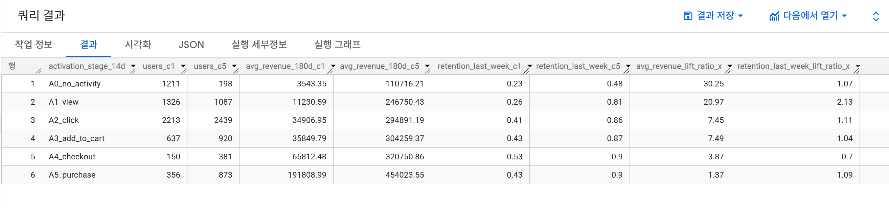
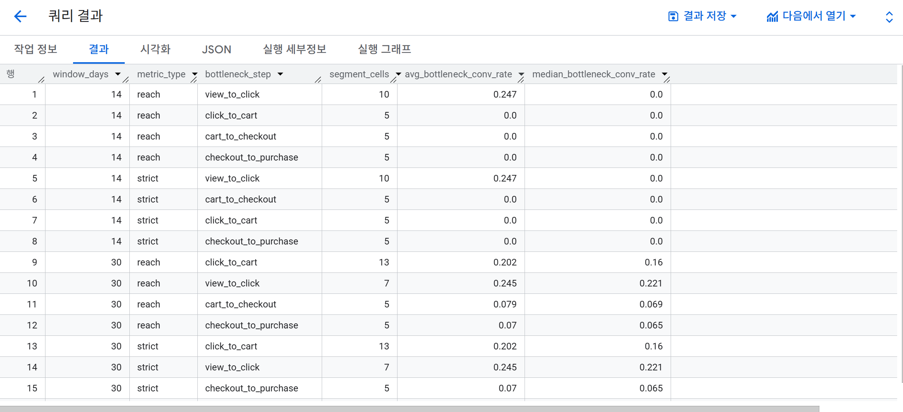
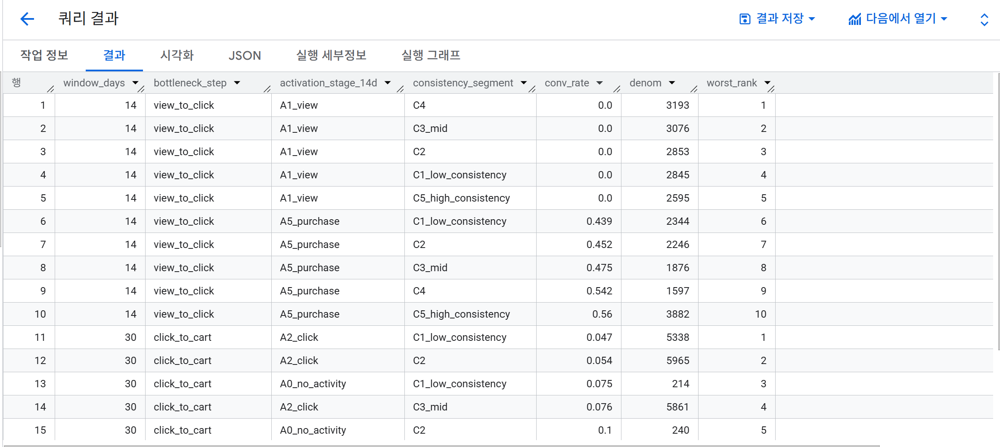
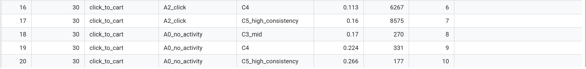
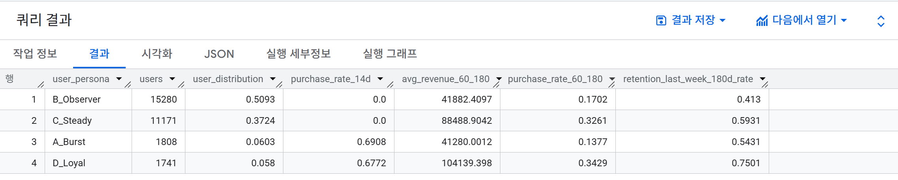
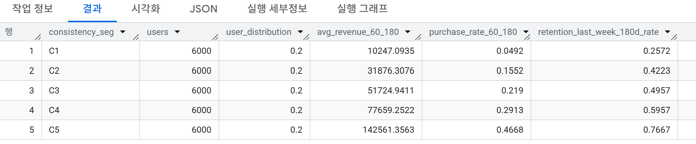
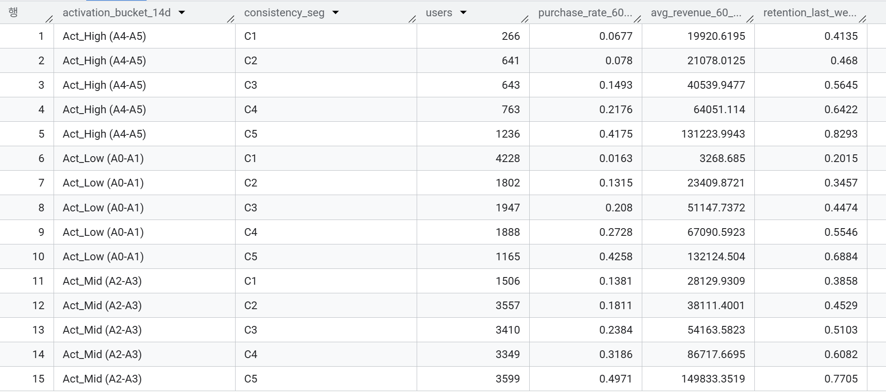

# [Story] Activation × Consistency → Future LTV/Retention (v1.0 → v1.1)

## 0) 분석 핵심 요약 (TL;DR)

**한 줄 결론:** 단기 전환(Activation)만으로는 장기 성과를 충분히 설명하기 어렵고, **방문 리듬(Consistency)** 이 60–180일 장기 KPI를 더 강하게 분리했다.

### Key insights
- **Insight 1:** Time-split 기준(0–60일 관측 → 60–180일 성과)으로 재검증했을 때도, **Activation 단독보다 Consistency가 장기 구매율·리텐션·매출을 더 선명하게 분리**했다.
- **Insight 2:** **Activation 수준이 같아도** Consistency(C1→C5)에 따라 장기 성과 차이가 크게 벌어졌다.  
  → 운영 단위는 Activation만이 아니라 **Activation × Consistency persona**로 보는 편이 더 합리적이다.
- **Insight 3:** 퍼널 병목은 하나가 아니었다.  
  **초기 14일에는 view→click 구간의 전사 공통 마찰**이 넓게 나타났고,  
  **30일 기준으로는 저일관성(C1/C2) 세그먼트의 click→cart 취약성**이 더 뚜렷했다.

### So what
- 전사적으로는 **초기 클릭 유도(view→click)** 개선이 필요하고,
- 세그먼트 단위로는 **저일관성 clickers의 click→cart 전환 실험**이 우선 과제다.

---

## 1) Problem

초기 전환(Activation) 지표는 서비스 초반 성과를 빠르게 확인하는 데 유용하다.  
하지만 **초기 전환이 높다고 해서 장기 리텐션이나 장기 매출까지 자동으로 보장되지는 않는다.**  
실무에서는 비슷한 수준의 초기 반응을 보인 사용자라도, 이후 얼마나 **규칙적으로 다시 방문하는지**에 따라 장기 성과가 크게 달라질 수 있다.

이 프로젝트는 이 지점에 주목했다. 핵심 질문은 다음과 같다.  
**“초기 전환만으로 장기 성과를 설명할 수 있는가, 아니면 방문 리듬(Consistency)이 추가적인 설명력을 가지는가?”**

만약 Activation만 보고 사용자를 해석하면, 단기 성과가 좋아 보이는 세그먼트에 과도하게 집중하고, 반대로 **초기 전환은 낮더라도 장기 가치가 높은 사용자군**을 놓칠 수 있다.  
이 경우 액션도 전사 공통 개선에 머물고, 실제로는 **어떤 세그먼트를 먼저 개선해야 하는지**를 놓치게 된다.

그래서 본 프로젝트에서는 **Activation**, **Consistency**, **장기 성과(구매·리텐션·매출)** 를 분리해서 보았고,  
동기간 지표 해석의 한계를 줄이기 위해 **0–60일은 관측 구간, 60–180일은 성과 구간**으로 나누는 **Time-split 기준**을 적용했다.  
이를 통해 Consistency가 장기 성과를 설명하는 선행 신호로 해석될 수 있는지 재검증하고자 했다.

---

## 2) Key Definitions

### 2.1 Activation stage (첫 14일)
Activation은 가입 후 첫 14일 동안 사용자가 퍼널의 어느 단계까지 도달했는지를 기준으로 본 초기 전환 신호다.  
본 프로젝트에서는 14일 내 이벤트 발생 여부(reach)를 만든 뒤, 단계 우선순위에 따라 A0~A5로 라벨링했다.

- A0: no activity
- A1: view
- A2: click
- A3: add_to_cart
- A4: checkout
- A5: purchase

### 2.2 Consistency (관측 0–60일)
Consistency는 가입 후 관측 구간 동안 사용자가 얼마나 규칙적인 리듬으로 다시 방문했는지를 나타내는 지표다.  
세션 기반 지표(예: active_days, intervisit_cv 등)를 바탕으로 score를 만들고, 이를 **C1(하위) ~ C5(상위)** 로 구간화했다.

### 2.3 Outcomes (성과 60–180일)
Outcomes는 가입 후 60–180일 구간에서 나타난 장기 성과를 의미한다.  
본 프로젝트에서는 구매율, 평균매출, 리텐션을 중심으로 비교했다.

---

### 3.1 Result 01 — Persona snapshot (Activation × Consistency)

> Persona는 **Activation(초기 14d)** × **Consistency(0–60d 방문 리듬)** 조합으로 정의했다.  
> Legend(Activation): **A/D = early purchase(14d 구매 있음)**, **B/C = no early purchase(14d 구매 없음)**  
> Legend(Consistency): **Burst·Observer = low consistency**, **Steady·Loyal = high consistency**

**Key takeaway**
- Time-split(관측 0–60d → 성과 60–180d) 기준에서도 persona별 **매출·구매율·리텐션**이 뚜렷하게 갈렸다.
- 특히 **C_Steady(14d 구매율 0.0%)가 A_Burst(69.1%)보다도** 60–180d 구매율(**32.6% vs 13.8%**)과 평균매출(**88,489 vs 41,280**)이 높아, **Consistency가 장기 성과를 가르는 핵심 축**임을 보여준다.

**Evidence**
- **(Activation 통제: 14d 구매율 0.0% 내부 비교)** **B_Observer → C_Steady**
  - 구매율(60–180d): **17.0% → 32.6% (+15.6%p)**
  - 평균매출(60–180d): **41,882 → 88,489 (2.1×)**
  - 리텐션(마지막 주): **41.3% → 59.3% (+18.0%p)**
- **(Early purchase가 높아도 Consistency에 따라 장기 성과가 갈림)** **A_Burst(69.1%) vs D_Loyal(67.7%)**
  - 구매율(60–180d): **13.8% vs 34.3% (+20.5%p)**
  - 평균매출(60–180d): **41,280 vs 104,139 (2.5×)**
  - 리텐션(마지막 주): **54.3% vs 75.0% (+20.7%p)**
- **Persona 분포(샘플 비중):**
  - **B_Observer:** 50.9% (n=15,280)
  - **C_Steady:** 37.2% (n=11,171)
  - **A_Burst:** 6.0% (n=1,808)
  - **D_Loyal:** 5.8% (n=1,741)

**So what**
- 초기 구매 여부(Activation)만으로 장기 성과를 판단하면 놓치는 그룹이 생긴다.
- 따라서 KPI 해석과 액션 설계는 Activation뿐 아니라 **재방문 리듬(Consistency)** 까지 포함한 **persona 단위**로 보는 편이 더 합리적이다.

**Figure**
- `persona_result.png` — Persona snapshot (Activation × Consistency)

**Query**
- `src/sql/analysis/story_core_v1.1/Persona_Analysis.sql`

> **Note (limitation):** synthetic 생성 가정/노이즈로 인해 persona의 **절대 순위**는 달라질 수 있다.  
> 본 결과는 **Activation vs Consistency의 역할 분리(프레임)** 이 time-split에서도 재현되는지에 초점을 둔다.

---

### 3.2 Result 02 — Consistency → Outcomes

**Key takeaway**
- Time-split(관측 0–60d → 성과 60–180d) 기준에서도, **Consistency가 높을수록 장기 구매율·매출·리텐션이 함께 상승**했다.
- 즉, 초기 60일의 방문 리듬은 이후 60–180일 성과를 설명하는 **핵심 선행 신호**로 해석할 수 있다.

**Evidence**
- 구매율(60–180d): **C1 4.9% → C5 46.7% (+41.8%p)**
- 평균매출(60–180d): **10,247 → 142,561 (13.9×)**
- 리텐션(마지막 주, day 174–180): **25.7% → 76.7% (+51.0%p)**

**So what**
- 장기 성과를 해석할 때는 Activation만 볼 것이 아니라, **Consistency를 별도의 핵심 축으로 함께 봐야 한다.**
- 이후 액션 설계에서도 “초기 반응이 있었는가”뿐 아니라, **그 사용자가 얼마나 규칙적으로 다시 돌아오는가**를 함께 반영해야 한다.
- 다음 결과에서는 이를 한 단계 더 나아가, **같은 Activation 수준 안에서도 Consistency 차이가 장기 성과를 가르는지**를 확인한다.

**Figure**
- `Consistency_outcome.png` — Time-split: Consistency (0–60d) → Outcomes (60–180d)

**Query**
- `src/sql/analysis/story_core_v1.1/04_timesplit__consistency_0_60_segment__outcomes_60_180.sql`

> **Note (limitation):** synthetic 생성 가정에 따라 효과 크기(lift)는 과장될 수 있다.  
> 본 결과는 인과 주장이라기보다 **방향성과 분석 프레임 검증**에 초점을 둔다.

---

### 3.3 Result 03 — Activation × Consistency → Outcomes

**Key takeaway**
- Time-split(관측 0–60d → 성과 60–180d)에서도 **같은 Activation 수준 안에서 Consistency(C1→C5)에 따라 장기 성과가 크게 갈렸다.**
- 즉, 초기 전환만으로는 장기 가치를 충분히 설명할 수 없었고, **같은 출발선 안에서도 방문 리듬 차이가 이후 성과를 갈랐다.**

**Evidence**
- **Act_Low (A0–A1)** 내부 비교
  - 구매율(60–180d): **1.6% → 42.6% (+41.0%p)**
  - 리텐션(마지막 주): **20.2% → 68.8% (+48.6%p)**
  - (C1→C5)
- **Act_High (A4–A5)** 내부 비교
  - 구매율(60–180d): **6.8% → 41.8% (+35.0%p)**
  - 리텐션(마지막 주): **41.4% → 82.9% (+41.5%p)**
  - (C1→C5)
- 동일 Activation bucket 내부에서도 **Consistency가 높아질수록 구매율·리텐션이 단조 상승**했다.

**So what**
- Activation만으로 타깃팅하면 **초기 전환은 낮지만 리듬이 좋은 high-consistency 유저**를 과소평가할 수 있다.
- 따라서 운영/개입 단위는 Activation 단독이 아니라 **Activation × Consistency persona**로 보는 편이 더 합리적이다.

**Figure**
- `Activation_x_consistency_outcome.png` — Activation (0–14d) × Consistency (0–60d) → Outcomes (60–180d)

**Query**
- `src/sql/analysis/story_core_v1.1/05_activation14d_x_consistency0_60d_summary.sql`

> **Note (limitation):** synthetic 데이터 특성상 효과 크기(lift)는 가정에 좌우될 수 있다.  
> 본 결과는 인과추정보다 **관계/프레임 검증**에 초점을 둔다.

---

## 4) Python Validation

SQL 기반 time-split 결과를 Python에서 다시 확인해,  
**분포·추세·불확실성 관점에서도 동일한 방향성이 유지되는지** 점검했다.

### 4.1 Validation focus
- **Retention trend:** Consistency(C1–C5)와 장기 리텐션의 단조 관계가 유지되는지 확인
- **Revenue distribution:** 평균 왜곡(outlier) 가능성을 줄이고, 분포/중앙값 기준에서도 동일 패턴이 보이는지 확인
- **Bootstrap CI:** 핵심 차이(C5 − C1)가 표본 변동성을 고려해도 일관적인지 확인

### 4.2 Key takeaway
- Python 시각화와 bootstrap CI에서도, **Consistency가 높을수록 장기 성과가 우상향하는 패턴**이 동일하게 재현됐다.
- 즉, SQL 집계 결과는 단순 평균치만의 산물이 아니라, **분포와 불확실성을 함께 보더라도 유지되는 방향성**으로 해석할 수 있다.

### 4.3 Evidence

#### (1) Retention trend (day 174–180)
> **Purpose:** Consistency(C1–C5)와 장기 리텐션의 단조 관계를 Python에서 재확인한다.  
> **Result:** **C1→C5 리텐션 우상향 패턴이 동일하게 재현**된다.

/fig_line_retention_174_180_by_consistency_segment_v1_1.png>)

#### (2) Revenue distribution (buyers-only, log1p revenue)
> **Purpose:** 평균 왜곡(outlier) 가능성을 줄이기 위해 구매자만 대상으로 `log1p(revenue_60_180)` 분포를 세그먼트별로 비교한다.  
> **Result:** 중앙값/분포에서도 **C1→C5 우상향 경향이 유지**되어 평균 기반 결론을 보강한다.

/fig_violin_log1p_revenue_60_180_buyers_only_by_consistency_segment_v1_1.png>)

#### (3) Bootstrap CI — C5 minus C1 (purchase_rate_60_180)
> **Purpose:** C5와 C1의 구매율 차이를 bootstrap으로 추정해 95% CI로 불확실성을 함께 제시한다.  
> **Result:** 구매율 차이(**+41.8%p**)가 **95% CI에서도 일관**하게 나타나 방향성 결론을 보강한다.

/fig_bootstrap_ci_c5_minus_c1_purchase_rate_60_180_v1_1.png>)

### 4.4 So what
- SQL 결과에서 확인한 **Consistency → 장기 성과** 패턴은, Python 기준으로도 **추세·분포·불확실성** 관점에서 같은 방향으로 확인됐다.
- 따라서 본 프로젝트의 핵심 해석은 단순 집계치 하나에 의존한 결론이 아니라,  
  **여러 관점에서 반복 확인된 방향성**으로 볼 수 있다.

**Notebook**
- `src/python/Python (EDA + Visualisation).ipynb`

**Figures**
- `docs/results/figures(python)/`

> **Note:** synthetic 데이터 기반이므로 절대 수치 자체보다,  
> **Consistency가 장기 성과를 반복적으로 분리하는 구조가 유지되는지**에 초점을 두고 해석했다.

---

## 3) Finding #2 — Consistency 격차는 낮은 Activation 구간에서 더 크게 관측된다 (v1.0)

### Key takeaway
- C5 vs C1 격차는 모든 Activation stage에서 관찰되며, 특히 low activation(A0–A2)에서 180d avg_revenue 배수(C5/C1)가 크게 나타난다 (A0 30.25x, A1 20.97x, A2 7.45x). 즉, 초기 퍼널 도달이 낮아도 Consistency가 높은 하위군은 장기 성과 잠재력이 있다.

### Evidence
- **Headline lift (avg_revenue, C5/C1)**: A0 30.25x, A1 20.97x, A2 7.45x (A3 7.49x, A4 3.87x, A5 1.37x)
- **Data insight**: Activation이 높아질수록(특히 A4–A5) 이미 “선별된” 유저 집단이 되어 **C1의 베이스가 올라가거나 상한(ceiling)** 이 생기면서 배수 격차가 축소될 수 있다.
- **Sample size check**: users_c1/users_c5를 함께 보고(표본이 작은 구간, 특히 A0·A4) 극단 배수는 보수적으로 해석한다.

### So what
- Low activation 구간에서도 “포기할 유저”를 Activation만으로 판단하면 놓칠 수 있다. **Consistency를 추가 신호로 사용해 타깃팅/개입 대상을 정교화**하면, 낮은 초기 행동에서도 장기 성과가 기대되는 하위군을 구분할 수 있다.

### Figure 02 — Headline lift (C5 vs C1) by Activation
- Query: `src/sql/analysis/00_story_core/02_headline_lift_c5_vs_c1_by_activation.sql`

> **Note (v1.0):**  
> v1.0은 동기간(0–180d) 지표 한계가 있어, 이 패턴은 v1.1 Time-split로 재확인한다.  
> 또한 lift는 ratio(C5/C1)이므로 C1 베이스가 낮은 구간(A0–A1)에서 배수가 더 커 보일 수 있어 표본(users_c1/users_c5)과 함께 해석한다.

---

## 4) Finding #3 — 퍼널 병목은 “전사 공통”과 “세그먼트 취약”으로 나누면 우선순위가 선명해진다 (v1.0)

### Key takeaway
- strict 기준으로 병목을 집계하면, **14d window에서는 view→click**이 가장 자주 발생하고, **30d window에서는 click→cart**가 가장 자주 발생한다. 즉, **초기(14일)는 ‘클릭 진입’**, 30일 관점에서는 **‘카트 전환’** 이 반복 병목으로 관측된다.

### Evidence
- **Bottleneck frequency (strict, 14d vs 30d)**
  - 14d 최빈 병목: **view→click**
  - 30d 최빈 병목: **click→cart**

### So what (transition)
- 병목을 **(1) 전사 공통 병목(발생 빈도)** 과 **(2) 세그먼트 취약 병목(특정 조합의 급격한 저성과)** 로 나누면,  
  **“전사 UX 개선”**(공통 병목)과 **“세그먼트 타깃 실험”**(취약 세그먼트)의 우선순위/역할 분담이 명확해진다.  
    
→ 다음 Finding #4에서 Worst Top10 세그먼트로 “취약 병목”을 구체화한다.

### Figure 04 — Bottleneck frequency (strict, 14d vs 30d)
- Query: `src/sql/analysis/00_story_core/02_bottleneck_frequency_reach_strict_w14_w30.sql`

---

## 5) Finding #4 — 취약 세그먼트 Top10을 보면 “개선 우선순위”가 더 구체적으로 잡힌다 (v1.0)

### Key takeaway
- **14d window** Worst Top10은 **view→click** 병목이 반복적으로 상위에 나타나며(특히 **A1_view** 조합), “view 이후 클릭으로 못 넘어가는” 초기 실패가 광범위하게 존재한다.
- **30d window** Worst Top10은 **click→cart** 병목이 다수이며, 특히 **A2_click × low consistency(C1/C2)** 에서 전환이 최저(≈4–5%)로 떨어진다(반면 C5는 ~16% 대비 3배+ 격차).

### Evidence
- **14d (Top10 패턴)**: view→click × A1_view 조합이 상위권을 반복하며, 일부는 **전환 0%** 도 포함한다. (denom 약 **2.6k–3.2k**)
- **30d (Top10 패턴)**: click→cart × A2_click 조합이 다수이고, **저일관성(C1/C2)** 에서 전환이 최저(≈4–5%)로 관측된다. 반면 **C5는 ~16%** 까지 회복한다.

### So what
- 개선 우선순위는 (1) **14d: view→click “전사 개선”**(첫 클릭 유도: 노출·카피·추천·UI)과  
  (2) **30d: click→cart “세그먼트 타깃 실험”**(저일관성 clickers 대상 개입)으로 역할을 분리하는 게 합리적이다.

### Figure 05 — Worst segments Top10 (strict, 14d vs 30d)
- Query: `src/sql/analysis/00_story_core/03_bottleneck_worst_segments_top10_strict_w14_w30.sql`

---

## 6) v1.1 — Time-split으로 “관측(0–60d) → 성과(60–180d)”를 분리해 재검증

### Key takeaway
- **Result:** v1.0의 핵심 패턴(Activation만으로는 부족하고, Consistency가 장기 성과를 추가로 분리)이 **time-split(관측 0–60d → 성과 60–180d)** 에서도 **재현**된다.
- **So what:** Consistency는 **초기 60일 행동/리듬 기반의 선행 신호**로 해석 가능하며, 동일 Activation 내부에서도 **장기 가치(매출/구매율/리텐션) 관점의 세그먼트 액션(타깃·개입)** 을 설계할 근거가 강화된다.
- **Evidence:** Result 01–03 (figures_v1.1)

v1.0은 “Activation만으로는 부족하고 Consistency가 성과와 함께 움직인다”는 패턴을 보여줬지만, 일부 지표가 **동기간(0–180d)** 에서 함께 계산되어 **tautology(동기간 산출)** 가능성을 완전히 배제하기 어렵다.

따라서 v1.1에서는 **관측 구간(0–60d)** 에서 early behavior/consistency를 정의하고, **성과 구간(60–180d)** 에서 outcomes(purchase/revenue/retention)를 측정해 **시간을 분리한 상태에서도 동일 패턴이 유지되는지** 재검증한다.

---

## 6.1) Result 01 — Persona snapshot (Activation × Consistency)

> Persona는 **Activation(초기 14d)** × **Consistency(0–60d 방문 리듬)** 조합으로 정의했다.  
> Legend(Activation): **A/D = early purchase(14d 구매 있음)**, **B/C = no early purchase(14d 구매 없음)**  
> Legend(Consistency): **Burst·Observer = low consistency**, **Steady·Loyal = high consistency**

### Key takeaway
- **Result:** time-split(60–180d) 기준에서도 persona별 **매출/구매율/리텐션**이 뚜렷하게 갈린다. 특히 **C_Steady(14d 구매율 0.0%)가 A_Burst(69.1%)보다도** 60–180d 구매율(**32.6% vs 13.8%**)과 평균매출(**88,489 vs 41,280**)이 높아, **Consistency가 장기 성과를 좌우하는 축**임을 보여준다.
- **So what:** “초기 구매 여부(Activation)”만으로 장기 성과를 판단하면 놓치는 그룹이 생긴다. 따라서 KPI/액션은 Activation뿐 아니라 **재방문 리듬(Consistency)** 까지 포함한 **persona 단위**로 설계하는 것이 합리적이다.
- **Evidence:** `persona_result.png` (Persona snapshot: Activation × Consistency)

### Evidence (60–180d outcomes)
- **(Activation 통제: 14d 구매율 0.0% 내부 비교)** **B_Observer → C_Steady**
  - 구매율(60–180d): **17.0% → 32.6% (+15.6%p)**
  - 평균매출(60–180d): **41,882 → 88,489 (2.1×)**
  - 리텐션(마지막 주): **41.3% → 59.3% (+18.0%p)**
- **(Early purchase가 높아도 Consistency에 따라 장기 성과가 갈림)** **A_Burst(69.1%) vs D_Loyal(67.7%)**
  - 구매율(60–180d): **13.8% vs 34.3% (+20.5%p)**
  - 평균매출(60–180d): **41,280 vs 104,139 (2.5×)**
  - 리텐션(마지막 주): **54.3% vs 75.0% (+20.7%p)**
- **Persona 분포(샘플 비중):** B_Observer **50.9% (n=15,280)**, C_Steady **37.2% (n=11,171)**, A_Burst **6.0% (n=1,808)**, D_Loyal **5.8% (n=1,741)**

### Figure — Persona snapshot (Activation × Consistency)
- Query: `src/sql/analysis/story_core_v1.1/Persona_Analysis.sql`  

> **Note (limitation):** synthetic 생성 가정/노이즈로 인해 persona의 **절대 순위**는 달라질 수 있다. 본 결과는 **Activation vs Consistency의 역할 분리(프레임)** 가 time-split에서도 재현되는지에 초점을 둔다.

---

## 6.2) Result 02 — Consistency (0–60d) → Outcomes (60–180d)

### Key takeaway
- **Result:** time-split(관측 0–60d → 성과 60–180d)에서도 Consistency가 높아질수록(C1→C5) **구매율/매출/리텐션이 단조 증가**한다.  
  - 예: 구매율(60–180d) **4.9% → 46.7% (+41.8%p)**, 리텐션(마지막 주) **25.7% → 76.7% (+51.0%p)** (C1→C5)
- **So what:** 초기 60일의 방문 리듬(Consistency)은 이후 120일 성과를 설명하는 **핵심 신호**다. KPI/액션은 Activation만 보지 말고 **Consistency를 함께** 포함해야 한다(→ 다음 Result에서 Activation 통제/교차에서도 재확인).
- **Evidence:** `Consistency_outcome.png` (Consistency 0–60d → Outcomes 60–180d)

### Evidence — Consistency segment summary (0–60d → 60–180d)
- 구매율(60–180d): **C1 4.9% → C5 46.7% (+41.8%p)**
- 평균매출(60–180d): **10,247 → 142,561 (13.9×)**
- 리텐션(마지막 주, day 174–180): **25.7% → 76.7% (+51.0%p)**

### Figure — Time-split: Consistency (0–60d) → Outcomes (60–180d)
- Query: `src/sql/analysis/story_core_v1.1/04_timesplit__consistency_0_60_segment__outcomes_60_180.sql`  

> **Note (limitation):** synthetic 생성 가정에 따라 효과 크기(lift)는 과장될 수 있다. 본 결과는 **인과 주장**이 아니라 **방향성/프레임 검증**에 초점을 둔다.

### Python validation (EDA / distribution)

#### Python Validation — Retention trend (day 174–180)
> **Purpose:** Consistency(C1–C5)와 180d 리텐션의 단조 관계를 Python에서 재확인한다.  
> **Result:** **C1→C5 리텐션 우상향 패턴이 동일하게 재현**된다.  
/fig_line_retention_174_180_by_consistency_segment_v1_1.png>)

#### Python Validation — Distribution (buyers-only, log1p revenue)
> **Purpose:** 평균 왜곡(outlier) 가능성을 줄이기 위해 구매자만 대상으로 `log1p(revenue_60_180)` 분포를 세그먼트별로 비교한다.  
> **Result:** 중앙값/분포에서도 **C1→C5 우상향 경향이 유지**되어 평균 기반 결론을 보강한다.  
/fig_violin_log1p_revenue_60_180_buyers_only_by_consistency_segment_v1_1.png>)

<b>Appendix — Bootstrap CI (C5 − C1, purchase_rate_60_180)</b>

> **Purpose:** C5와 C1의 구매율 차이를 bootstrap으로 추정해 95% CI로 불확실성을 함께 제시한다.  
> **Result:** 구매율 차이(**+41.8%p**)가 **95% CI에서도 일관**하게 나타나 방향성 결론을 보강한다.  

/fig_bootstrap_ci_c5_minus_c1_purchase_rate_60_180_v1_1.png>)

---

## 6.3) Result 03 — Activation × Consistency → Outcomes (time-split)

### Key takeaway
- **Result:** time-split(관측 0–60d → 성과 60–180d)에서도 **Activation 수준이 같아도 Consistency(C1→C5)에 따라 성과가 크게 갈린다.**
  - 예: **Act_Low(A0–A1)** 구매율(60–180d) **1.6% → 42.6% (+41.0%p)**, 리텐션 **20.2% → 68.8% (+48.6%p)** (C1→C5)
  - 예: **Act_High(A4–A5)** 구매율(60–180d) **6.8% → 41.8% (+35.0%p)**, 리텐션 **41.4% → 82.9% (+41.5%p)** (C1→C5)
- **So what:** **Activation만으로 타깃팅하면** “초기 전환은 낮지만 리듬이 좋은(high-consistency) 유저(특히 Act_Low/Act_Mid의 C5)”를 **과소평가**할 수 있다.  
  → 운영/개입의 단위는 **Activation 단독이 아니라 Activation×Consistency(persona)**가 더 합리적이다.
- **Evidence:** `Activation_x_consistency_outcome.png` (Activation 0–14d × Consistency 0–60d → Outcomes 60–180d)

### Figure — Time-split: Activation (0–14d) × Consistency (0–60d) → Outcomes (60–180d)
- Query: `src/sql/analysis/story_core_v1.1/05_activation14d_x_consistency0_60d_summary.sql`  

동일 Activation bucket 내부에서도 Consistency가 높아질수록(C1→C5) **구매율/매출/리텐션이 단조 상승**한다.  
즉, time-split 이후에도 **Consistency는 Activation을 보완하는 추가 신호**로 작동한다.

> **Note (limitation):** synthetic 데이터 특성상 효과 크기(lift)는 가정에 좌우될 수 있어, 본 결과는 **인과추정보다 관계/프레임(해석 구조) 검증**에 초점을 둔다.

<b>Python Validation — Heatmap (Purchase rate, 60–180d)</b>

> **Purpose:** Activation stage(0–14d) × Consistency(C1–C5) 교차에서 60–180d 구매율이 두 축에 따라 어떻게 달라지는지 한 번에 확인한다.  
> **Result:** (1) 동일 Activation stage 내에서도 **C1→C5로 갈수록 구매율이 상승**하고, (2) 동일 Consistency 구간 내에서도 **Activation stage가 높을수록 구매율이 상승**하는 패턴이 재현된다.  

/fig_heatmap_purchase_rate_60_180_by_activation_x_consistency_v1_1.png>)

---

## 7) A/B Test: 관찰 결과를 “개입 효과” 관점에서 검증

### 7.1 왜 A/B Test를 했나 (After v1.1)
v1.0/v1.1(Time-split) 분석에서는 **Consistency(방문 리듬/규칙성)** 가 60–180일 구간 성과(매출/리텐션)와 강하게 연관되는 패턴을 확인했다.  
다만 이 결과는 어디까지나 **관찰(Observational) 기반**이라, time-split으로 누수 위험을 줄였더라도 **교란/선택 효과** 가능성을 완전히 제거할 수는 없다.

따라서 “관찰된 패턴이 실제 개입(intervention)으로도 성과를 움직일 수 있는가?”를 확인하기 위해, **신규 유입 유저 코호트(베이스라인과 분리된 별도 사용자 집합)** 를 대상으로 **2×2 factorial A/B Test**를 수행했다.  
목표는 무작위 배정 하에서 **Consistency/Activation 개입이 각각 장기 KPI(60–180 ΔE[rev])와 초기 KPI(0–13 전환)에 어떤 영향을 주는지** 확인하는 것이다.

---

### 7.2 실험 설계 요약 (2×2 factorial)
- **대상**: 신규 유입 코호트(베이스라인과 분리), 4개 셀에 균등 배정
- **Factor**
  - **Activation uplift (A)**: **초기 전환(0–13일)** 개선을 목표로 하는 소폭 개입
  - **Consistency uplift (C)**: 초기 생애주기에서 **방문 리듬/규칙성(weekly cadence)** 을 강화하는 개입
- **셀 구성**: CC(대조), CT(C만), TC(A만), TT(A+C)
- **장기 KPI(Primary)**: **60–180 ΔE[rev]**
  - 60–180일 구간의 기대매출 변화(0 포함 평균; *synthetic units*)
- **초기 KPI(Secondary)**: **0–13일 early conversion / 주문율**
- **추정/해석 기준**: bootstrap 95% CI
  - 95% CI가 **0을 포함하지 않으면**, 방향성 있는 효과로 해석한다.
  - 95% CI가 **0을 포함하면**, 현 결과만으로 효과를 확정하기 어렵다.

> 데이터/분석 파이프라인: AB 전용 신규 유입 코호트(베이스라인과 분리)로 데이터셋을 생성한 뒤, DM_ab_user_kpi → CSV export → Python(bootstrap) 흐름으로 효과를 추정했다.

---

### 7.3 결과 (그래프 2장으로 핵심만)

#### Figure 7-1. Bootstrap 분포: 60–180 ΔE[rev]에서 Consistency main effect
Consistency main effect의 bootstrap 95% CI가 0을 상회하여, 60–180 ΔE[rev]에서 **Consistency main effect가 양(+)의 방향임을 시사**한다.  
(모든 금액 단위는 *synthetic units*로 표기)

/fig01_ab_bootstrap_deltaErev_hist.png>)

> 캡션: “Bootstrap 95% CI가 0을 상회 → 60–180 ΔE[rev]에서 Consistency main effect가 +방향임을 시사.”

---

#### Figure 7-2. Main effects 비교: Activation vs Consistency vs Interaction (60–180 ΔE[rev])
동일 KPI(60–180 ΔE[rev]) 기준에서 효과 크기를 비교하면:
- Consistency main effect가 60–180 ΔE[rev]에서 가장 큰 +효과를 보인다.
- Activation main effect는 +방향이지만 Consistency 대비 효과 크기가 작다.
- Interaction(A×C)은 95% CI가 0을 포함하여, 상호작용 효과는 불확실하다.

/fig02_ab_main_effects_deltaErev_bar.png>)

> 캡션: “Consistency가 가장 큰 +효과를 보이며, Activation은 +방향이지만 효과 크기가 작다. Interaction(A×C)은 95% CI가 0을 포함해 상호작용 효과는 불확실하다.”

---

### 7.4 보조 지표(전환율)로 확인한 패턴
Primary KPI는 60–180 ΔE[rev]이지만, **전환율 기반 지표**에서도 개입 방향이 일관적인지 확인했다(아래 값은 **point estimate**).

#### (a) 60–180 구매율(purchase rate)
| exp_cell | purchase_rate (60–180) |
|---|---:|
| CC | 0.2408 |
| CT | 0.2608 |
| TC | 0.2473 |
| TT | 0.2633 |

- 구매율 관점에서도 **Consistency uplift**가 +방향(CT/TT 상승)이며, Activation의 효과는 상대적으로 작다.

#### (b) 0–13 초기 주문율(early order rate)
| exp_cell | early_order_rate (0–13) |
|---|---:|
| CC | 0.0681 |
| CT | 0.0613 |
| TC | 0.0803 |
| TT | 0.0800 |

- 초기 주문율은 **Activation uplift**가 +방향(TC/TT 상승)으로 나타난다.

> 참고(효과 요약, point estimate):  
> - (60–180 구매확률 Δp) Activation: +0.0045, Consistency: +0.0180, Interaction: -0.0040  
> - (0–13 초기전환 Δp0) Activation: +0.0154, Consistency: -0.0035, Interaction: +0.0065

---

### 7.5 해석
- **Consistency uplift → 장기 KPI(60–180 ΔE[rev])**: bootstrap 95% CI가 0을 상회하여, 60–180 기대매출 개선에 대한 근거가 확인된다.
- **Activation uplift → 초기 KPI(0–13 전환)**: Activation은 0–13일 초기 전환 지표에서 개선 신호가 관찰되며, 장기 KPI에 대한 해석은 보수적으로 유지한다.
- **Interaction(A×C)**: interaction 항의 95% CI가 0을 포함하여, 현 결과만으로 상호작용 효과를 확정하기는 어렵다.

**결론**
1) 장기 성과(60–180 기대매출)를 목표로 하면, 우선순위는 **Consistency 개입**이 더 높다.  
2) **Activation은 초기 전환(0–13일)** 관점에서 의미가 있으며, 장기 효과는 보수적으로 해석한다.

---

## Appendix 1) Used Data Marts (v1.0)
- `ecommerce_dm.DM_user_window`
- `ecommerce_dm.DM_consistency_180d`
- `ecommerce_dm.DM_ltv_180d`
- `ecommerce_dm.DM_retention_cohort`
- `ecommerce_dm.DM_funnel_kpi_window`
- `ecommerce_dm.DM_funnel_session`

## Appendix 2) Used Data Marts (v1.1)
- `ecommerce_dm.DM_timesplit_60_180_final`

## Appendix 3) Used Data Marts (A/B Test)
- `ecommerce_dm_ab.AB_user_kpi` — 실험 셀(exp_cell), 윈도우 KPI(0–13, 60–180), ΔE[rev] 및 분석용 feature를 구성해 Python으로 export한 기준 테이블
